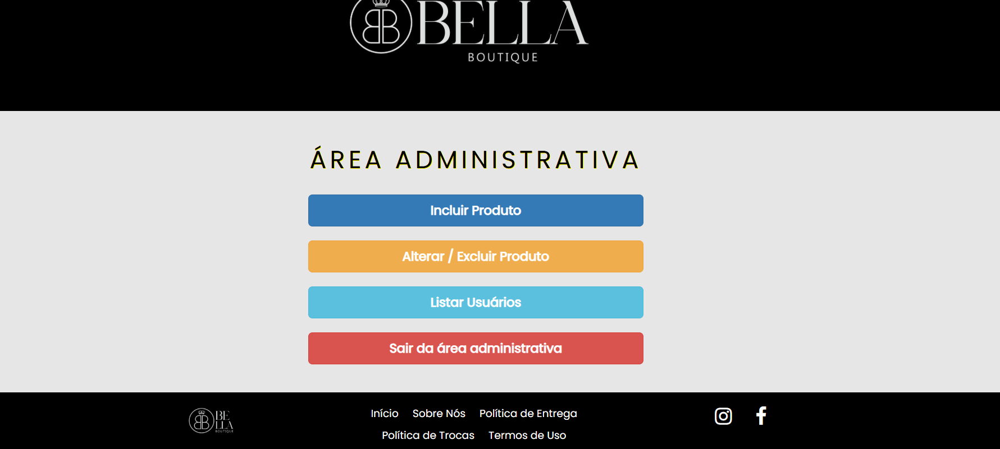

## Sobre o projeto
Sistema de E-commerce para loja de roupas femininas da minha cidade utilizando PHP, JavaScript, HTML, CSS e MySQL.

O sistema foi projetado para oferecer uma experiência de compra intuitiva, incluindo funcionalidades como:
- Cadastro e autenticação de usuários
- Gerenciamento de produtos
- Carrinho de compras
- Integração com banco de dados MySQL
## 📸 Preview

